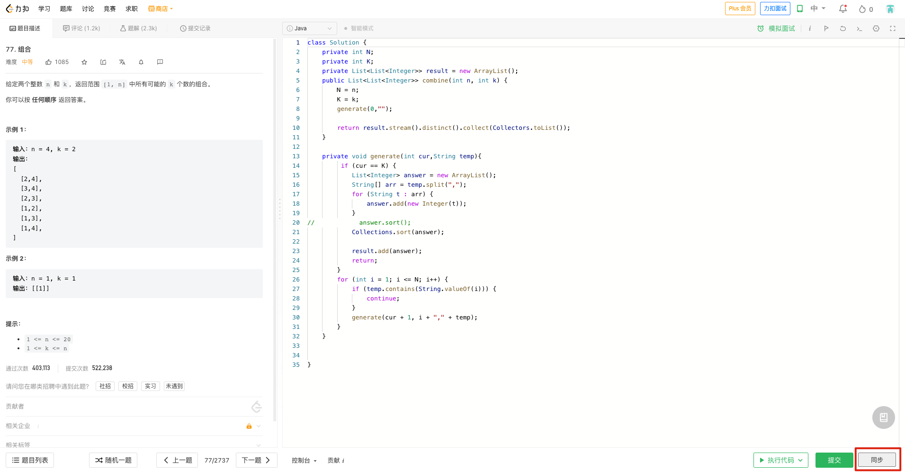
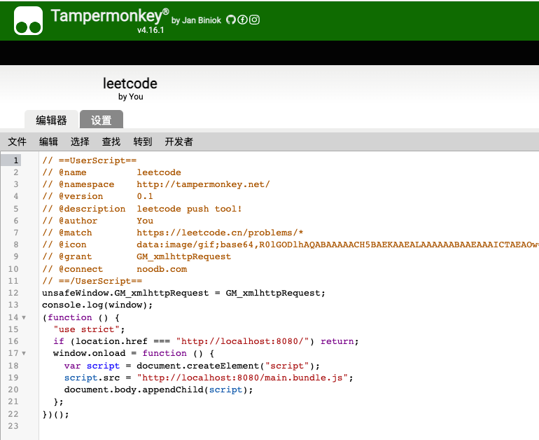
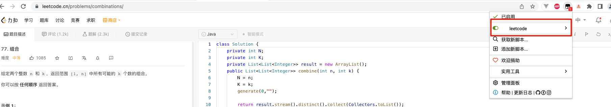

lcTool主要是在leetcode刷题的时候，将提交的代码和题目，同步到个人播客中，记录下来。
# 实现的功能
1、提交代码的时候，自动将题目和code，组装成markdown博客，然后自动push到个人博客,效果类似于 [格雷码](https://noodb.com/blog/1557628290926342145)

2、手动同步 （在leetcode提交按钮旁边）

# 实现技术
使用tampermonkey插件，使用自己开发的脚本实现。

# 开发

1、启动开发模式
```shell
npm run serve
```
2、将src的tampermonkey.js复制到tampermonkey里面保存即可。


3、看看生效即可。


